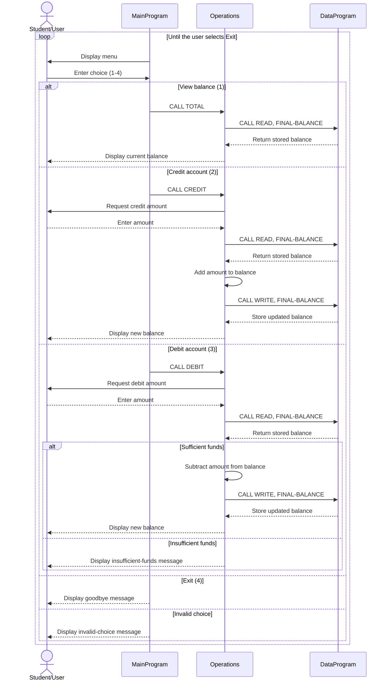

# COBOL Account Management Documentation

This directory documents the COBOL account management example in `src/cobol`.

## Program Overview

The application is a console-based account manager. It starts with a balance of `1000.00` and allows the user to view the balance, credit the account, debit the account, or exit.

The current implementation manages one shared account balance. It does not yet store student names, student IDs, or separate balances for multiple students.

## COBOL Files

### `main.cob`

**Purpose:** Provides the user-facing console menu and controls the application loop.

**Key functions:**

- Displays the account management options.
- Accepts a numeric choice from the user.
- Calls `Operations` with one of these six-character operation codes:
  - `TOTAL ` to view the balance.
  - `CREDIT` to add funds.
  - `DEBIT ` to subtract funds.
- Continues until the user selects option `4`.
- Displays an error message for choices outside `1` through `4`.

### `operations.cob`

**Purpose:** Implements balance-related business operations.

**Key functions:**

- Reads the current balance before performing an account operation.
- Displays the current balance for a total inquiry.
- Accepts a credit amount, adds it to the balance, and saves the result.
- Accepts a debit amount, checks available funds, subtracts it when permitted, and saves the result.
- Displays a confirmation message after successful credits and debits.
- Rejects a debit when the requested amount exceeds the current balance.

### `data.cob`

**Purpose:** Provides the in-memory balance data service used by `Operations`.

**Key functions:**

- Stores the balance in `STORAGE-BALANCE`, initially `1000.00`.
- Handles the `READ` operation by copying the stored balance to the caller.
- Handles the `WRITE` operation by replacing the stored balance with the caller's value.
- Returns control to the calling program with `GOBACK`.

The balance is held in working storage, so it is not persisted after the program ends.

## Student Account Business Rules

The source code does not model student-specific data, but its current account rules are:

1. The initial account balance is `1000.00`.
2. A credit increases the balance by the entered amount.
3. A debit is allowed only when the current balance is greater than or equal to the entered amount.
4. A debit that would exceed the balance is rejected with an insufficient-funds message, and the stored balance remains unchanged.
5. Balance changes are written back only after a successful credit or debit.
6. The application supports one shared account balance; there is no student selection or account isolation.
7. Amounts use a numeric format with two decimal places and a maximum of six digits before the decimal point (`9(6)V99`).
8. The implementation does not validate whether entered amounts are positive, so input validation would be needed before using this as a production student-account system.

## Operation Flow

`MainProgram` receives the user's choice and calls `Operations`. `Operations` then calls `DataProgram` with `READ` or `WRITE` to retrieve or update the shared balance.

## Sequence Diagram

